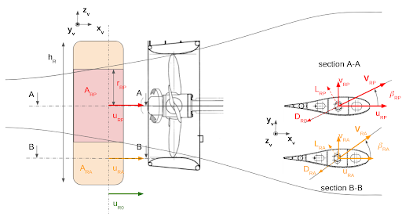
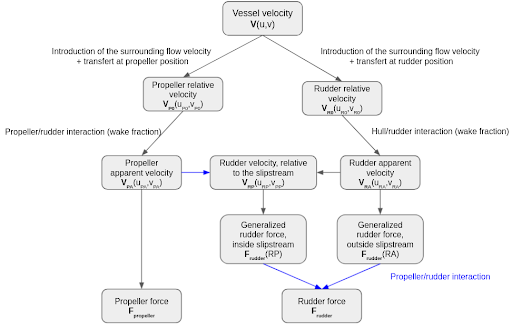
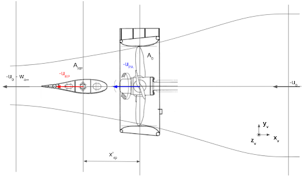

Propeller-rudder model
======================

Frames and conventions
----------------------

The convention used here is NWU.

The present model is based on the following approximation: the rudder stock is perpendicular to the propeller axis.
As such, the velocity components given as inputs : :math:`u_{NWU}` and :math:`v_{NWU}` are respectively, collinear to
the propeller axis, and perpendicular to both the propeller and rudder axes.

Methodology
-----------

While the hull/propeller/rudder interactions are mutual interactions between these 3 actors, only the rudder force model
is usually corrected to take into account these interactions. The propeller loads in the propeller-rudder model are then
the same as described in section :ref:`propeller_model`.

The propeller influence on the rudder is mainly due to the propeller slipstream washing the rudder.
Generally the interaction models are based on the “load separation principle” under the following assumptions:

 - the whole rudder lateral projected area is decomposed into the area washed by the slipstream :math:`A_{RP}` and the remaining area :math:`A_{RA}`: :math:`A_R = A_{RP} + A_{RA}`. It is possible to approximate the area washed by the slipstream by : :math:`A_{RP} = \dfrac{h_{RP}}{h_R} A_R = 2\dfrac{r_{RP}}{h_R} A_R`
 - the rudder speed with respect to water and its attack angle are :math:`V_{RP}` and :math:`\alpha_{RP}` inside the slipstream and :math:`V_{RA}̀` and :math:`\alpha_{RA}` outside (based on :math:`u_{RA}` and :math:`v_{RA}` , see section Hull-rudder interaction)
 - the rudder coefficients are the same inside and outside the slipstream

.. _fig_prop_rudder_decomposition:

    Propeller rudder decomposition representation

The rudder generalized force can then be decomposed in

.. math::
    F_{rudder} = F_{rudder}(RA) + F_{rudder}(RP)

and for the different components

.. math::
    \begin{cases}
    D_{RA} &=& \dfrac{1}{2} \rho C_d(\alpha_{RA}) A_{RA} V_{RA}^2\\
    L_{RA} &=& \dfrac{1}{2} \rho C_l(\alpha_{RA}) A_{RA} V_{RA}^2\\
    N_{RA} &=& \dfrac{1}{2} \rho C_n(\alpha_{RA}) A_{RA} V_{RA}^2\\
    \end{cases}

.. math::
    \begin{cases}
    D_{RP} &=& \dfrac{1}{2} \rho C_d(\alpha_{RP}) A_{RP} V_{RP}^2\\
    L_{RP} &=& \dfrac{1}{2} \rho k_d C_l(\alpha_{RP}) A_{RP} V_{RP}^2\\
    N_{RP} &=& \dfrac{1}{2} \rho C_n(\alpha_{RP}) A_{RP} V_{RP}^2\\
    \end{cases}

where :math:`k_d` is the jet deflection reduction factor applied on the lift component in the slipstream only, and specified later.

.. warning::
    Since the rudder velocities relative to the flow inside the slipstream :math:`V_{RP}` and outside :math:`V_{RA}` are not concurrent (see :any:`previous figure<fig_prop_rudder_decomposition>`), two inflow frames must be considered as well : :math:`R_{fRP}` and :math:`R_{fRA}` which are defined as described in section :ref:`rudder_model`, from respectively :math:`V_{RP}` and :math:`V_{RA}`. Therefore, their components (drag, lift, torque) cannot be summed.

Flowchart
---------

The :any:`following figure<fig_prop_rudder_flowchart>` illustrates the relations between the different velocities involved in the hull/propeller/rudder interactions.

.. _fig_prop_rudder_flowchart:

    Flow chart of the velocities involved in the hull/propeller/rudder interactions

Slipstream effect
-----------------

The rudder speed with respect to water and its attack angle in the slipstream can be found using the classic actuator
disc theory, see :any:`following figure<fig_prop_rudder_actuator_disk>`, and detailed in [Brix1993]_.

.. _fig_prop_rudder_actuator_disk:

    Representation of the velocities in the actuator disc theory

Because rudder forces are proportional to the flow speed squared at the rudder, an accurate determination of the speed
in the propeller slipstream at the rudder positions is required to correctly predict rudder forces. According to the momentum
theory of the propeller, the mean axial speed of the slipstream far behind the propeller is

.. math::
    u_\infty = u_{PA} \sqrt{1+C_{Th}}

where :math:`C_{Th}` is the thrust loading coefficient

.. math::
    C_{Th} = \dfrac{T}{q A_p} = \dfrac{T}{0.5 \rho \pi R_p^2 u_{PA}^2}

The theoretical slipstream radius behind the propeller follows from the law of continuity, assuming that the mean axial
speed at the propeller is the average between :math:`u_{PA}` and :math:`u_\infty`

.. math::
    r_\infty = R_P \sqrt{0.5 (1+ u_{PA}/u_{\infty}}

Influence of distance from the propeller
++++++++++++++++++++++++++++++++++++++++

Since the rudder is not located at the infinity behind the propeller, the slipstream radius and axial velocity at the
propeller location can be approximated [Soding1982] by

.. math::
    r_{RP} = R_P \dfrac{0.14 \left( \dfrac{r_\infty}{R_P}\right)^3 + \dfrac{r_\infty}{R_P} \left(\dfrac{x}{R_P}\right)^{1.5}}{0.14 \left( \dfrac{r_\infty}{R_P}\right)^3 + \left(\dfrac{x}{R_P}\right)^{1.5}}

and

.. math::
    u_{x} = u_{infty} \left(\dfrac{r_\infty}{r_{RP}}\right)^2

where :math:`x_RP` is the distance from the propeller to the rudder (positive if the rudder is behind the propeller).

Influence of turbulent mixing
+++++++++++++++++++++++++++++

The previous slipstream radius approximation can be refined by considering the turbulence mixing of the slipstream with
the surrounding fluid. The slipstream radius can then be augmented by

.. math::
    \Delta r = 0.15 \dfrac{u_{x} - u_{PA}}{u_{x} + u_{PA}}

in the same manner, the axial velocity can be corrected by

.. math::
    u_{RP} = (u_{x} - u_{PA}) \left( \dfrac{r_{RP}}{r_{RP} + \Delta r} \rigth)^2 + u_{PA}

Influence of lateral variation of flow speed
++++++++++++++++++++++++++++++++++++++++++++

A jet deflection correction factor is applied to the rudder lift component, to account for the finite lateral extent of
the slipstream, when the rudder deviates the flow coming from the propeller. The approximation from [Soding1982]_ is
based on the transformation of the circular cross-section of the slipstream to a quadratic one.

.. math::
    \begin{cases}
    k_d &=& \left(\dfrac{u_{PA}}{u_{RP}}\right)^f\\
    f &=& 2 \left(\dfrac{2}{2+d/c}\right)^8\\
    d &=& \sqrt{\pi/4}(r+\Delta r)
    \end{cases}

Lateral velocity in the slipstream
++++++++++++++++++++++++++++++++++

The lateral velocity in the slipstream at the rudder position is approximated to the one outside the slipstream

.. math::
    v_{RP} = v_{RA}

References
----------
.. [Brix1993] Brix, J. (1993). Manoeuvring technical manual. Hamburg, Germany: Seehafen Verlag.
.. [Soding1982] Söding, H. (1982). Prediction of ship steering capabilities. Schiffstechnik, 29(1), 3-29.