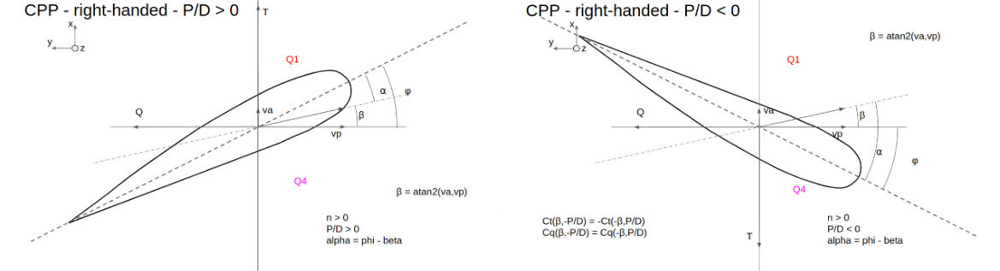

.. _propeller_model:

Propeller model
===============

Frames and conventions
----------------------

The conventions applying to the propeller model are :

* the propeller reference frame is direct, with the :math:`x` axis corresponding to the propeller axis and pointing from the propeller to the shaft, so that the thrust is positive in its design conditions
* a clockwise rotation corresponds to a positive propeller rotational velocity : :math:`n>0`,
* a right-handed propeller is by design (positive pitch ratio) supposed to turn in a clockwise rotation, and a left-handed propeller in a counter-clockwise rotation,

According to these conventions, the propeller frame, in which the thrust and torque are expressed, is represented in the :any:`following figure <fig_propu_frame>`.

.. _fig_propu_frame:

    Propeller frame representation, for a right-handed propeller

First quadrant model
--------------------

Also known as the Open Water model, it gives the propeller thrust and torque as functions of the advance ratio:

.. math::
   :nowrap:

   \begin{eqnarray}
    T &=& \rho D^4 k_T(J) n^2 \\
    Q &=& \rho D^5 k_Q(J) n^3
   \end{eqnarray}

where

- :math:`k_T(J)` and :math:`k_Q(J)` are the dimensionless open-water coefficients,
- :math:`J = \dfrac{v_a}{nd}` is the dimensionless advance ratio,
- :math:`v_a` is the vessel advance speed, relatively to the ambient fluid velocity, in :math:`m/s`,
- :math:`n` is the propeller rotational velocity, in :math:`rps`,
- :math:`D` is the propeller diameter, in :math:`m`
- :math:`\rho` is the water density, in :math:`kg/m^3`

This model is designed for marine vehicles with a steady forward speed, in a transit mode. It is therefore not adequate
for dynamic positioning or cruising maneuvers, in which the the vessel advance speed and/or propeller rotational velocity
can change sign or go down to zero, leading to potentially infinite advance ratio.

Four quadrants model
--------------------

The four quadrants model was introduced to cope for the open water model limits by van Lammeren et al. [vanLammeren]_.
It is therefore valid for the 4 regions, commonly referred to as ahead, crash-back, back and crash-ahead, as defined in
the following table. Those quadrants are described in a macro fashion, using the signs of the vessel advance speed (forward, backward) and the thrust (propulsive or resistive).

.. table:: Macro description of the 4 quadrants of operations

    =========== =========== =========== ===========
    Quadrant    Name        sign(va)    sign(T)
    =========== =========== =========== ===========
    Q1          Ahead       \+           \+
    Q2          Crash-back  \+           \-
    Q3          Backing     \-           \-
    Q4          Crash-ahead \-           \+
    =========== =========== =========== ===========

.. _fig_quadrants:

    Description of the 4 quadrants of operation, for a right-handed propeller

.. warning::
    This definition is different from the quadrants description traditionally defined to match the :math:`J`, :math:`k_T` and :math:`k_Q` nomenclature.
    It is also different to the one, based on the advance angle, below.

Advance angle
+++++++++++++

In order to express the thrust and torque coefficients in the 4 quadrants, the advance angle was introduced:

.. math::
    \beta_p = atan2(\dfrac{v_a}{v_p \delta_{tp}})

with

- :math:`v_p = 0.7 \omega R = 0.7 \pi n D` the tangential velocity of the propeller at a distance of :math:`0.7R` from the propeller axis,
- :math:`\delta_{tp} = 1` for right-handed propellers and :math:`\delta_{tp} = -1` for left-handed propellers, to account for the propeller type design rotational velocity sign.

The advance angle range is thus :math:`[-\pi; \pi]`.

With this angle, the four quadrants are described slightly differently than the previous macro description, based on the signs of the vessel advance speed and the propeller rotational velocity.

.. table:: Advance angle description of the 4 quadrants of operations

    =========== =========== ================= ============================== ======================
    Quadrant    Name        :math:`sign(v_a)` :math:`sign(v_p \delta_{tp})`  :math:`\beta_p`
    =========== =========== ================= ============================== ======================
    Q1          Ahead       \+                 \+                              :math:`[0;\pi/2]`
    Q2          Crash-back  \+                 \-                              :math:`[\pi/2;\pi]`
    Q3          Backing     \-                 \-                              :math:`[-\pi/2;-\pi]`
    Q4          Crash-ahead \-                 \+                              :math:`[-\pi/2;0]`
    =========== =========== ================= ============================== ======================

The following figures show the advance angle related to the different quadrants, for a right and a left-handed propeller.
For both cases, the propeller axis is vertical, in front of the figure. The blade is rotating to the right for the right-handed propeller, and to the left for the left-handed propeller.
The advance angles are drawn for a first quadrant (ahead) condition. We can observe that, while the thrust is positive for both cases, the torque is positive for right-handed propeller and negative for left-handed one.

.. _fig_advance_angle:

    Advance angle and quadrants relations

The pitch angle of the propeller blade is :math:`\phi` and is linked to the pitch ratio by the following relation :

.. math::
    \dfrac{P}{D} = \pi tan(\phi)

The attack angle at the propeller blade is then :math:`\alpha = \phi - \beta_p`.

Thrust and torque models:
+++++++++++++++++++++++++

The force and torque coefficients, functions of the advance angle :math:`\beta_p` are :

.. math::
   :nowrap:

   \begin{eqnarray}
    T &=& \dfrac{1}{2} \rho c_T(\beta_p) (v_a^2 + v_p^2) \pi R^2\\
    Q &=& \dfrac{1}{2} \rho c_Q(\beta_p) (v_a^2 + v_p^2) \pi R^2 D
    \end{eqnarray}

Experimental data were established for a large range of propellers and nozzle, the Wageningen B- and Ka-series
(for bare and ducted FPP propellers), published  in [vanLammeren]_ and [Oosterveld]_.
An extensive discussion of the four-quadrant model in relation to control and  thrust estimation is given in [Pivano]_.

Hull/propeller interactions
---------------------------

The hull/propeller interaction is a mutual interaction : the behaviour of the propeller is affected by the ship,
likewise propeller operation behind the ship affects the behaviour of the ship. The hull-on-propeller interaction is
indicated by the wake fraction while the propeller-on-hull interaction is signified by the thrust deduction fraction,
a decrease of thrust as an alteration of increase of the ship resistance due to propeller actions.

While the thrust deduction factor :math:`t_p` affects the propeller thrust

.. math::
    X_p = T (1-t_p)

the wake factor :math:`\omega_p` affects the propeller advance speed

.. math::
    u_{PA} = k_u u_{P0}(1-\omega_p)

where :math:`u_{P0}` is the vessel longitudinal velocity, relatively to the surrounding flow, at the propeller position.

A supplementary correction factor :math:`k_u` can be introduced (Sutulo 2011) to match the efficiency maximum as provided by
the used  propeller model with the design propulsion point. This advance velocity correction factor can be established
using the formula:

.. math::
    k_u = \dfrac{J_{opt} n_d D}{V_d (1-\omega_{p0}}

where :math:`J_{opt}` is the maximum efficiency advance ratio, :math:`n_d` is the propeller design rotation frequency
(in rps), and :math:`V_d` is the vessel's design speed.

While the thrust factor can be considered constant for all manoeuvring conditions, the wake fraction is generally
expressed using the vessel sidewash angle $beta_{P0} = atan2\left(\dfrac{v_{P0}}{u_{P0}}\right)$, based on an empirical
formulation [Inoue1981]_:

.. math::
    \omega_p = \omega_{p0} e^{-K_1 \beta_{P0}^2}

where :math:`\omega_{p0}` is the straight-run wake fraction and :math:`K_1` is an empirical constant.
According to Inoue [Inoue1981]_, classical values for these parameters are :math:`\omega_{p0} = 0.4` and :math:`K_1`.
When the absolute value of the sidewash angle exceeds 90 degrees, it is usually assumed :math:`\omega_p=0`.

Relations between Open Water and four quadrants models
------------------------------------------------------

While the Open Water and four quadrants models are defined on different spaces, with respectfully the advance ratio and
the advance angle, it is possible to express a relation between the two models.

.. math::
   :nowrap:

   \begin{eqnarray}
    \beta_p &=& atan2\left(\dfrac{v_a}{0.7\pi nd} \right) = atan2 \left( \dfrac{J}{0.7\pi} \right) \\
    J &=& 0.7 \pi tan(\beta_p)
    \end{eqnarray}

for :math:`J \in [0;1]`, :math:`\beta_p \in [0;25]` degrees.

the thrust and torque coefficients are related through the following equations

.. math::
   :nowrap:

   \begin{eqnarray}
    k_T(J) &=& \dfrac{\pi}{8} c_T(\beta_p) (J^2 + 0.7^2 \pi^2)\\
    k_Q(J) &=& \dfrac{\pi}{8} c_Q(\beta_p) (J^2 + 0.7^2 \pi^2)
    \end{eqnarray}

Controllable Pitch Propeller (CPP)
----------------------------------

A CPP is characterized by a fixed rotational velocity and a varying pitch ratio, on contrary to the Fixed Pitch Propellers (FPP).
According to the previous definition of the 4 quadrants and the advance angle, the CPP is only meant to work in the first and last quadrants, i.e. for positive propeller rotational velocity.
This means that technically, Open Water coefficients given for positive and negative advance ratios are sufficient to characterize a CPP propeller.
However, the Open Water coefficients presents a discontinuity for zero advance ratio, but it is then possible to transform these coefficients to four quadrant coefficient in the first and last quadrant, as seen above.

.. _fig_CPP:

    Controllable pitch propeller cases

This means that the thrust and torque coefficients, :math:`c_T` and :math:`c_Q` must be functions of the pitch ratios.
Systematic series were also performed on CPP propeller : the Wageningen C- and D-series (C for CPP and D for Ducted CPP).
Results are not yet available in the literature though.

References
----------

.. [vanLammeren] van Lammeren, W.P.A., van Manen, J.D., and Oosterveld, M.W.C. (1969). The Wageningen B-Screw Series. Transactions of SNAME, 77, 269–317.
.. [Oosterveld] Oosterveld, M.W.C. (1970). Wake Adapted Ducted Propellers. Ph.D. thesis, Delft University of Technology, Wageningen, The Netherlands.
.. [Pivano] Pivano, L. (2008). Thrust Estimation and Control of Marine Propellers in Four-quadrant Operations. Ph.D. thesis, Norwegian University of Science and Technology (NTNU), Trondheim, Norway.
.. [Inoue1981] Inoue, S., Hirano, M., Kijima, K., & Takashina, J. (1981). A practical calculation method of ship manoeuvring motion. International Shipbuilding Progress, 28(325), 207-222.