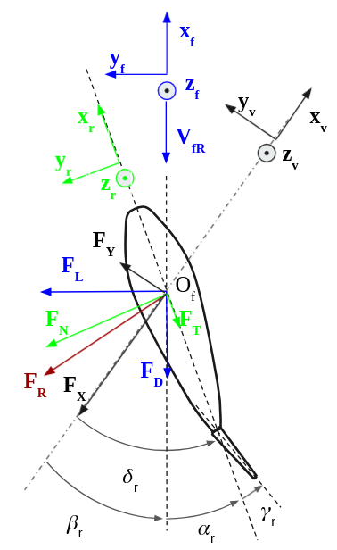
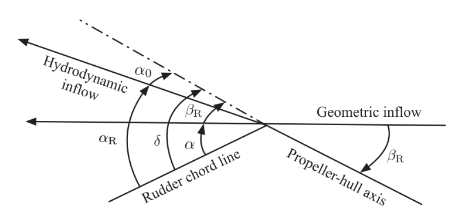

.. _rudder_model:

Rudder models
=============

Frames and conventions
----------------------

The convention used here is NWU (North-West-Up).

Three frames can be defined to expressed the rudder loads, see the following :ref:`figure <fig_rudder_frame>`.

- the vessel frame :math:`R_v=(x_v,y_v,z_v)`, with :math:`F_R = (F_X, F_Y, 0)_{R_v}`
- the rudder frame :math:`R_r=(x_r,y_r,z_r)`, with :math:`F_R = (F_T, F_N, 0)_{R_r}`
- the inflow frame :math:`R_f=(x_f,y_f,z_f)`, with :math:`F_R = (F_D, F_L, 0)_{R_f}`

The drag :math:`F_D` and lift :math:`F_L` contributions are expressed respectfully collinear and perpendicular to the inflow
velocity field :math:`V_{fR}`. The normal :math:`F_N` and tangent :math:`F_T` contributions are relative to the rudder
orientation.

.. _fig_rudder_frame:

    Rudder frame representation

The rudder attack angle :math:`\alpha_r` can be expressed using the rudder deflection angle :math:`\delta_r` and the
local drift angle :math:`\beta_r`.

.. math::
    \alpha_r = \delta_r - \beta_r

The projection of the rudder loads from the inflow frame, to the vessel frame is then

.. math::
    \begin{cases}
        F_X &=& F_D \cos(\beta_r) - F_L \sin(\beta_r)\\
        F_Y &=& F_D \sin(\beta_r) + F_L \cos(\beta_r)
    \end{cases}

The projection from the rudder frame to the vessel frame is

.. math::
    \begin{cases}
        F_X &=& F_T \cos(\delta_r) - F_N \sin(\delta_r)\\
        F_Y &=& F_T \sin(\delta_r) + F_N \cos(\delta_r)
    \end{cases}

..
    And the projection from the rudder frame to the inflow frame is
    .. math::
        \begin{cases}
            F_D &=& T \cos(\alpha_r) + F_N \sin(\alpha_r)\\
            F_L &=&-T \sin(\alpha_r) + F_N \cos(\alpha_r)
        \end{cases}

Drag-Lift model
---------------

The drag, lift and torque at the rudder stock can be expressed as function of the attack angle:

.. math::
    \begin{cases}
        F_D &=& \dfrac{1}{2} \rho C_d(\alpha_r) A_r V_{fRA}^2\\
        F_L &=& \dfrac{1}{2} \rho C_l(\alpha_r) A_r V_{fRA}^2\\
        M_n &=& \dfrac{1}{2} \rho C_n(\alpha_r) A_r c V_{fRA}^2\\
    \end{cases}

where :math:`\rho` is the water density, :math:`A_r` is the projected lateral area and :math:`c` is the rudder chord.

:math:`(C_d(\alpha_r), C_l(\alpha_r), C_n(\alpha_r))` can be obtained via CFD computations.

Brix' estimation formulas
-------------------------

Brix [Brix1993]_ (eqs 1.2.1 to 1.2.11) gave estimations for the drag, lift and stock moment coefficients, for small attack angles.
Additional parameters are required:

- :math:`d` : the longitudinal distance from the rudder's nose to its stock, in meters, positive;
- :math:`C_f` : the rudder frictional resistance coefficient which can be computed from the ITTC57 formula:

.. math::
    C_f = \dfrac{0.075}{(log_{10}Rn - 2)^2}`

- :math:`C_q` : a resistance coefficient :math:`C_q \approx 1`, according to Brix, for rudders with sharp upper and lower edges. A lower value is expected for rudders with rounded edges (difficult in practice)

.. math::
    \begin{cases}
        F_D &=& \dfrac{1}{2} \rho C_d(\alpha_r) A_r V_{fRA}^2\\
        F_L &=& \dfrac{1}{2} \rho C_l(\alpha_r) A_r V_{fRA}^2\\
        M_n &=& \dfrac{1}{2} \rho C_{qr}(\alpha_r) A_r c V_{fRA}^2\\
    \end{cases}

.. math::
    \begin{cases}
        C_d &=& -(C_{d1} + C_{d2})\\
        C_l &=& C_{l1} + C_{l2}\\
        C_{qr} &=& C_{qn} + \dfrac{d}{c} (C_l \cos(\alpha_r) + C_d \sin(\alpha_r))\\
        C_{qn} &=& -(C_{l1}\cos(\alpha_r) + C_{d1} \sin(\alpha_r))\left(0.47 - \dfrac{\Lambda+2}{4(\Lambda+1)}\right)\\
                && - 0.75 (C_{l2}\cos(\alpha_r) + C_{d2} \sin(\alpha_r))
    \end{cases}

.. math::
    \begin{cases}
        C_{d1} &=& 1.1 \dfrac{C_l^2}{\pi \Lambda}\\
        C_{d2} &=& C_q |\sin(\alpha_r)|^3 + C_{d0}\\
        C_{d0} &=& 2.5 C_f\\
        C_{l1} &=& \dfrac{2\pi \Lambda (\Lambda+1}{(\Lambda + 2)^2} \sin(\alpha_r)\\
        C_{l2} &=& C_q \sin(\alpha_r) |\sin(\alpha_r)| \cos(\alpha)
    \end{cases}

where :math:`\Lambda = \dfrac{b}{c} = \dfrac{A_r}{c^2}` is the rudder geometric aspect ratio, with :math:`b` and :math:`c`
the rudder span and chord respectively.

Fujii's estimation formula
--------------------------

Widely used in the manoeuvring community, Fujii's method [Fujii1960]_ only considers the normal load, and neglects the
tangential component. This assumption is only applicable for small attack angles. The normal component is estimated as:

.. math::
    F_N = \dfrac{1}{2} \rho A_R V_{fRA}^2 f_{\alpha}\sin (\alpha_r)

where :math:`\rho` is the water density, :math:`A_r` is the projected lateral area and :math:`f_\alpha` is:

.. math::
    f_\alpha = 6.13 \dfrac{\Lambda}{\Lambda + 2.25}

where :math:`\Lambda = B_R/C_R = A_R/C_R^2` is the rudder geometric aspect ratio. :math:`B_R` and :math:`C_R` are the
rudder span and rudder chord respectively.

The rudder loads in the vessel frame are then

.. math::
    \begin{cases}
        F_X &=& - F_N \sin(\delta_r)\\
        F_Y &=& F_N \cos(\delta_r)\\
        M_n &=& 0
    \end{cases}

Hull/propeller/rudder interactions
----------------------------------

.. _rudder_lift_correction:

Correction on the loads
+++++++++++++++++++++++

As for the propeller, the hull/rudder interaction involves a correction of the longitudinal due to the presence of the
propeller [Yasukawa2015]_, but also an additional transverse load, generated at the afterbody, due to the presence of
the hull [Brix1993]_ (eq 1.2.31).
While the original transverse force is applied at the rudder longitudinal position :math:`x_R`, the additional load is applied
at the rudder hydrodynamic longitudinal location, :math:`x_H`. Several empiric estimations are given for this parameter,
a gross approximation is to take :math:`x_H = -0.45 Lpp` (when :math:`x_R = -0.5 Lpp` generally).

The rudder forces and torque expressed at the rudder position are then

.. math::
    \begin{cases}
        X_r &=& (1 - t_R) F_X\\
        Y_r &=& (1 + a_H) F_Y\\
        N_r &=& M_n + a_H(x_H - x_R) F_Y
    \end{cases}

with :math:`t_R` the steering resistance deduction factor and :math:`a_H` the rudder force increase factor.

Wake fraction
+++++++++++++

The hull/rudder interaction also involves a correction of the axial inflow velocity, with the rudder wake fraction

.. math::
    u_{RA} = u_{R0}(1-\omega_r)

where :math:`u_{R0}` is the vessel longitudinal velocity, relatively to the surrounding flow, at the rudder position.

.. math::
    V_{fRA} = - V_{RA} = - u_{RA} x_v - v_{RA} yv

The rudder wake fraction can be expressed as a function of the vessel sidewash angle :math:`\beta_{R0} = atan2 \left(\dfrac{v_{R0}}{u_{R0}} \right)`, at the rudder position:

.. math::
    \omega_r = \omega_{r0} e^{-K_1 \beta_{R0}^2}

Hull flow straightening effect
++++++++++++++++++++++++++++++

The Sutulo's model is implemented, see the following section for a more complete description of the phenomenon and the
different models available.

Hull flow straightening effect
------------------------------

Terminology
+++++++++++

When the ship drifts with an angle :math:`\beta`, the hull straightens the inflow at the propeller-rudder location,
leading to a reduced drift angle, :math:`\beta_R`, and consequently an augmented attack angle, :math:`\alpha_R`.
The :ref:`following figure <fig_flow_straightening_terminology>` shows the terminology applied in the flow straightening
effect.

.. _fig_flow_straightening_terminology:

    Flow straightening terminology. Adapted from Molland and Turnock [Molland1995a]_

.. math::
    \delta = \alpha + \beta_R = \alpha_R + \alpha_0 = \alpha_R + \gamma_R \beta_R

where :math:`\delta` is the rudder deflection angle, :math:`\alpha` is the geometric attack angle, :math:`\alpha_0` is
the incidence for zero lift, :math:`\beta_R` is the drift angle at the rudder location. :math:`\gamma` is the flow
straightening factor, which depends on the form of the hull body, the drift angle, the propeller loading [Molland1995b]_.
For twin rudders ships, it also depends on the side of the rudders relatively to the sign of the drift angle.

Several models were proposed for defining the flow straightening factor, mainly for ships in the first quadrant of operation.
The flow straightening factor can be found either on the estimation of the effective attack angle as above, or on the
determination of the rudder transverse velocity.

Inoue's model
+++++++++++++

Inoue's model was introduced in [Inoue1981]_ and is based on the application of the flow straightening factor to the
effective rudder angle.

.. math::
    \begin{cases}
    \alpha_R &=& \delta + \delta_0 - \gamma_R \beta_R\\
    \beta_R &=& \beta - 2 x'_r r'\\
    \gamma_R &=& C_P C_S\\
    \end{cases}

where :math:`C_P` is the propeller flow rectification, and :math:`C_S` is the ship hull flow rectification. Only this last
term is of interest in this section, and it is given by Inoue as:

.. math::
    C_S = \begin{cases}
            K_3 \beta_R & \text{for} & \beta_R &\leq& \dfrac{C_{S0}}{K3}\\
            C_{S0} & \text{for} & \beta_R &>& \dfrac{C_{S0}}{K3}\\
        \end{cases}

with :math:`K_3 = 0.45` and :math:`C_{S0} = 0.5`.

Kose's model
++++++++++++

Introduced at the same time as Inoue's model, this model is expressed slightly differently, in terms of :math:`\alpha_R u_R/U`:

.. math::
    \dfrac{\alpha_R u_R}{U} = (\delta - \delta_0)\dfrac{u_R}{U} - \gamma_R(v' + x'_R r')

Kose [Kose1982]_ identified :math:`\gamma_R = 0.364` and :math:`x'_R = 0.907`, based on experimental results on Series 60.

Brix [Brix1993]_ later changed the model to express directly the rudder transverse velocity

.. math::
    v_R = - 0.364 v + 0.66 x_R r = 0.364 (v + 2 \times 0.907 x_R r)

MMG model
+++++++++

In the similar fashion, Yasukawa and Yoshimura [Yasukawa2015]_ expressed the rudder transverse velocity as a function of
the straighten rudder drift angle:

.. math::
    v_R = U \gamma_R \beta_R = U \gamma_R (\beta - l'_R r')

They pointed out that the two constants :math:`\gamma_R` and :math:`l'_R` might differ for port and starboard rudders.

Sutulo's model
++++++++++++++

Sutulo extended Inoue's model in the four quadrants of operation, and applied the flow straightening factor to the rudder
transverse velocity.

.. math::
    v_{RA} = \kappa_v(\beta_R) v_{R0}

where :math:`\kappa_v` is the flow straightening corrective function, and :math:`\beta_R = atan2(v + k x_r r, u)`.

.. math::
    \kappa_v = \begin{cases}
        min(K2, K3 |\beta_R| & \text{for} & |\beta_R| &<& \beta_1 = 1.3 rad \\
        a_v + b_v |\beta_R|  & \text{for} & |\beta_R| &\in& [\beta_1; \beta_2] \\
        1                    & \text{for} & |\beta_R| &>& \beta_2 = \dfrac{\pi}{2} \\
    \end{cases}

where

.. math::
    \begin{cases}
    a_v &=& K_2 - b_v \beta_1 \\
    b_v &=& \dfrac{1-K_2}{\beta_2 - \beta_1}
    \end{cases}

and :math:`K2 = 0.5`, :math:`K3 = 0.45` (as in Inoue's model).

References
----------
.. [Brix1993] Brix, J. (1993). Manoeuvring technical manual. Hamburg, Germany: Seehafen Verlag.
.. [Fujii1960] Fujii, H., 1960. Experimental researches on rudder performance (1) (in Japanese). J. Zosen Kiokai 107, 105–111.
.. [Kose1982] Kose, K. (1982). On a new mathematical model of maneuvering motions of a ship and its applications. International Shipbuilding Progress, 29(336), 205-220.
.. [Molland1995a] Molland, A. F., & Turnock, S. R. (1995). Wind tunnel tests on the effect of a ship hull on rudder-propeller performance at different angles of drift.
.. [Molland1995b] Molland, A. F., Turnock, S. R., & Smithwick, J. E. T. (1995). Wind tunnel tests on the influence of propeller loading and the effect of a ship hull on skeg-rudder performance.
.. [Yasukawa2015] Yasukawa, H., & Yoshimura, Y. (2015). Introduction of MMG standard method for ship maneuvering predictions. Journal of Marine Science and Technology, 20(1), 37-52.