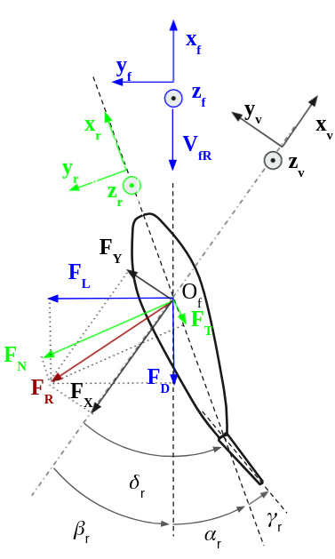

.. _rudder_model:

Rudder model
============

Frames and conventions
----------------------

The convention used here is NWU.

The drag and lift contributions are expressed respectfully collinear and perpendicular to the inflow velocity field :math:`V_{fR}`,
with the introduction of a frame :math:`R_f=(O_f,x_f,y_f,z_f)` defined by:

- :math:`O_f` is ont the rudder stock, the rudder rotation axis,
- :math:`z_f` is collinear to the rudder stock, pointing upwards,
- :math:`y_f = z_f \times \dfrac{-V_{fR}{|V_{fR}|}`, in order to get lift and drag forces in a plane perpendicular to the rudder axis,
- :math:`x_f = y_f \times z_f`, so that the frame is orthogonal and direct

.. _fig_rudder_frame:

    Rudder frame representation

The rudder attack angle :math:`\alpha_r` can be expressed using the rudder deflection angle :math:`\delta_r` and the
local drift angle :math:`\beta_r`.

Expression of the force
-----------------------

The generalized force is expressed in the :math:`R_f` frame :

.. math::
   F_{rudder} =
   \begin{bmatrix}
    D & 0 \\
    L & 0 \\
    0          & N
   \end{bmatrix}_{R_f}

with the drag, lift and torque components

.. math::
    \begin{cases}
        D &=& \dfrac{1}{2} \rho C_d(\alpha_r) A_r V_{fRA}^2\\
        L &=& \dfrac{1}{2} \rho C_l(\alpha_r) A_r V_{fRA}^2\\
        N &=& \dfrac{1}{2} \rho C_n(\alpha_r) A_r c V_{fRA}^2\\
    \end{cases}

where :math:`\rho` is the water density, :math:`A_r` is the projected lateral area and :math:`c` is the rudder chord.

..
    The projection to the rudder frame can be written:
    .. math::
        \begin{cases}
            X_{Rr} &=&-D cos(\alpha) - L sin(\alpha)\\
            Y_{Rr} &=& D sin(\alpha) - L cos(\alpha)\\
            N_{Rr} &=& N
        \end{cases}
    :math:`X_{Rr}` and :math:`Y_{Rr}` are respectfully the tangential and normal components of the rudder forces, in the
    rudder reference frame. A common approximation in the literature is to consider only the normal component, the tangential
    being small.

Hull/rudder interactions
------------------------

Correction on the lift
++++++++++++++++++++++

As for the propeller, the hull/rudder interaction involves a correction of the lift, due to the upstream presence of the
hull. However, an additional transverse force of equal direction is generated at the afterbody. Compared to the rudder
lift without hull interaction, the total transverse force is increased by the factor :math:`1+a_H`.

.. math::
    L = (1 + a_H) \dfrac{1}{2} \rho C_l(\alpha_r) A_r V_{fRA}^2

Compared to the free running rudder, the total transverse force application point is shifted forward by :math:`\Delta x_R`.
The total torque at the rudder position is then

.. math::
    N = \dfrac{1}{2} \rho C_n(\alpha_r) A_r c V_{fRA}^2 + \Delta x_R L

Wake fraction
+++++++++++++

The hull/rudder interaction also involves a correction of the axial inflow velocity, with the rudder wake fraction

.. math::
    u_{RA} = u_{R0}(1-\omega_r)

where :math:`u_{R0}` is the vessel longitudinal velocity, relatively to the surrounding flow, at the rudder position.

.. math::
    V_{fRA} = - V_{RA} = - u_{RA} x_v - v_{RA} yv

The rudder wake fraction can be expressed as a function of the vessel sidewash angle :math:`\beta_{R0} = atan2 \left(\dfrac{v_{R0}}{u_{R0}} \right)`, at the rudder position:

.. math::
    \omega_r = \omega_{r0} e^{-K_1 \beta_{R0}^2}

Hull flow straightening effect
------------------------------

Terminology
+++++++++++

When the ship drifts with an angle :math:`\beta`, the hull straightens the inflow at the propeller-rudder location,
leading to a reduced drift angle, :math:`\beta_R`, and consequently an augmented attack angle, :math:`\alpha_R`.
The :ref:`following figure <fig_flow_straightening_terminology>` shows the terminology applied in the flow straightening
effect.

.. _fig_flow_straightening_terminology:

    Flow straightening terminology. Adapted from Molland and Turnock [Molland1995a]_

.. math::
    \delta = \alpha + \beta_R = \alpha_R + \alpha_0 = \alpha_R + \gamma_R \beta_R

where :math:`\delta` is the rudder deflection angle, :math:`\alpha` is the geometric attack angle, :math:`\alpha_0` is
the incidence for zero lift, :math:`\beta_R` is the drift angle at the rudder location. :math:`\gamma` is the flow
straightening factor, which depends on the form of the hull body, the drift angle, the propeller loading [Molland1995b]_.
For twin rudders ships, it also depends on the side of the rudders relatively to the sign of the drift angle.

Several models were proposed for defining the flow straightening factor, mainly for ships in the first quadrant of operation.
The flow straightening factor can be found either on the estimation of the effective attack angle as above, or on the
determination of the rudder transverse velocity.

Inoue's model
+++++++++++++

Inoue's model was introduced in [Inoue1981]_ and is based on the application of the flow straightening factor to the
effective rudder angle.

.. math::
    \begin{cases}
    \alpha_R &=& \delta + \delta_0 - \gamma_R \beta_R\\
    \beta_R &=& \beta - 2 x'_r r'\\
    \gamma_R &=& C_P C_S\\
    \end{cases}

where :math:`C_P` is the propeller flow rectification, and :math:`C_S` is the ship hull flow rectification. Only this last
term is of interest in this section, and it is given by Inoue as:

.. math::
    C_S = \begin{cases}
            K_3 \beta_R & \text{for} & \beta_R &\leq& \dfrac{C_{S0}}{K3}\\
            C_{S0} & \text{for} & \beta_R &>& \dfrac{C_{S0}}{K3}\\
        \end{cases}

with :math:`K_3 = 0.45` and :math:`C_{S0} = 0.5`.

Kose's model
++++++++++++

Introduced at the same time as Inoue's model, this model is expressed slightly differently, in terms of :math:`\alpha_R u_R/U`:

.. math::
    \dfrac{\alpha_R u_R}{U} = (\delta - \delta_0)\dfrac{u_R}{U} - \gamma_R(v' + x'_R r')

Kose [Kose1982]_ identified :math:`\gamma_R = 0.364` and :math:`x'_R = 0.907`, based on experimental results on Series 60.

Brix [Brix1993]_ later changed the model to express directly the rudder transverse velocity

.. math::
    v_R = - 0.364 v + 0.66 x_R r = 0.364 (v + 2 \times 0.907 x_R r)

MMG model
+++++++++

In the similar fashion, Yasukawa and Yoshimura [Yasukawa2015]_ expressed the rudder transverse velocity as a function of
the straighten rudder drift angle:

.. math::
    v_R = U \gamma_R \beta_R = U \gamma_R (\beta - l'_R r')

They pointed out that the two constants :math:`\gamma_R` and :math:`l'_R` might differ for port and starboard rudders.

Sutulo model
++++++++++++

Sutulo extended Inoue's model in the four quadrants of operation, and applied the flow straightening factor to the rudder
transverse velocity.

.. math::
    v_{RA} = \kappa_v(\beta_R) v_{R0}

where :math:`\kappa_v` is the flow straightening corrective function, and :math:`\beta_R = atan2(v + k x_r r, u)`.

.. math::
    \kappa_v = \begin{cases}
        min(K2, K3 |\beta_R| & \text{for} & |\beta_R| &<& \beta_1 = 1.3 rad \\
        a_v + b_v |\beta_R|  & \text{for} & |\beta_R| &\in& [\beta_1; \beta_2] \\
        1                    & \text{for} & |\beta_R| &>& \beta_2 = \dfrac{\pi}{2} \\
    \end{cases}

where

.. math::
    \begin{cases}
    a_v &=& K_2 - b_v \beta_1 \\
    b_v &=& \dfrac{1-K_2}{\beta_2 - \beta_1}
    \end{cases}

and :math:`K2 = 0.5`, :math:`K3 = 0.45` (as in Inoue's model).

References
----------
.. [Brix1993] Brix, J. (1993). Manoeuvring technical manual. Hamburg, Germany: Seehafen Verlag.
.. [Kose1982] Kose, K. (1982). On a new mathematical model of maneuvering motions of a ship and its applications. International Shipbuilding Progress, 29(336), 205-220.
.. [Molland1995a] Molland, A. F., & Turnock, S. R. (1995). Wind tunnel tests on the effect of a ship hull on rudder-propeller performance at different angles of drift.
.. [Molland1995b] Molland, A. F., Turnock, S. R., & Smithwick, J. E. T. (1995). Wind tunnel tests on the influence of propeller loading and the effect of a ship hull on skeg-rudder performance.
.. [Yasukawa2015] Yasukawa, H., & Yoshimura, Y. (2015). Introduction of MMG standard method for ship maneuvering predictions. Journal of Marine Science and Technology, 20(1), 37-52.