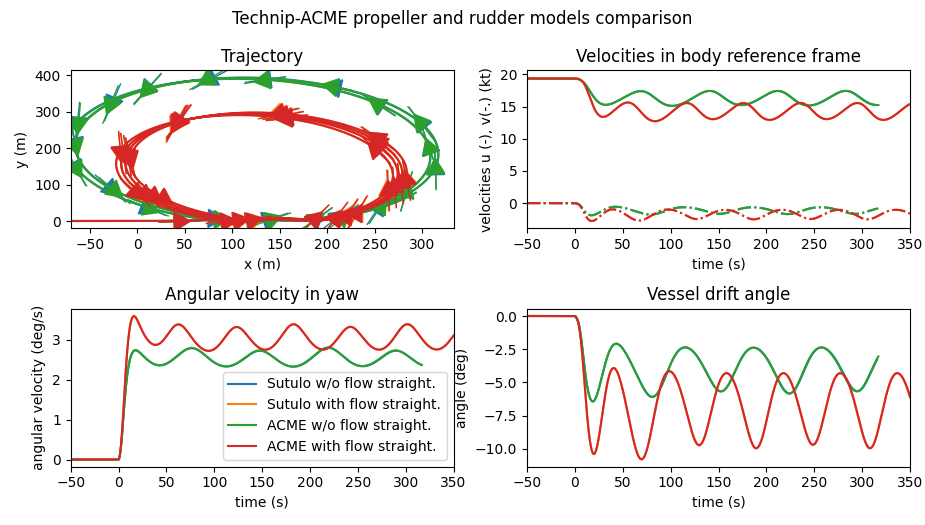
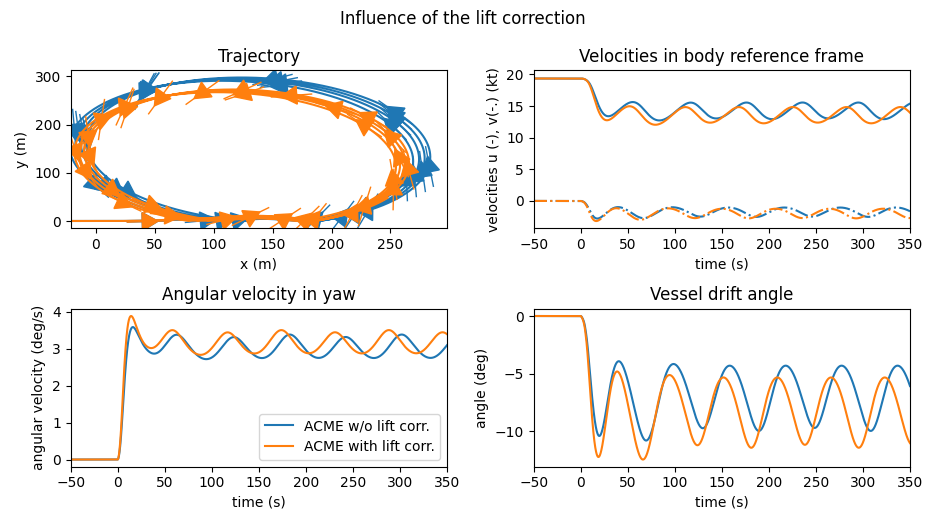
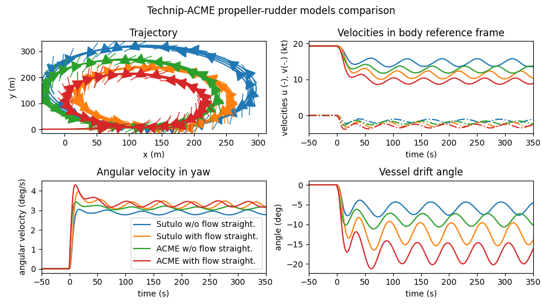
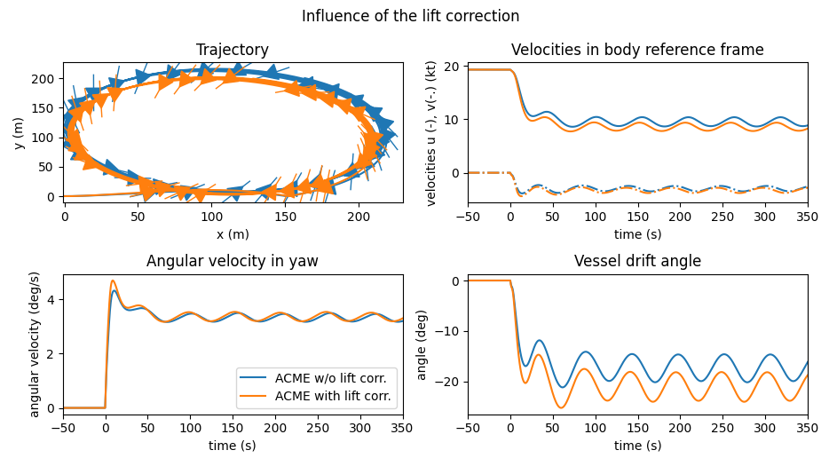

.. _validations:

Validations
===========

Non-regression
--------------

ACME was initiated after the RDX022 project, in which propulsion models were needed for the definition of a manoeuvrability
global model. At that time, Sutulo's models [Sutulo2015]_ were chosen, in order to simulate operations in the four quadrants.

Due to some inconsistencies, notably in the propeller-rudder interaction model, it was decided to change for Brix' model [Brix1993]_
for ACME's propeller-rudder interaction model. A hull-rudder interaction was also omitted in the RDX022 rudder model,
namely the correction on the lift force, via the introduction of an additional lift force, see the section :ref`_rudder_lift_correction`.

Turning circles (TC) and zig zag (ZZ) manoeuvres were simulated during the RDX022, for a tug, which manoeuvrability coefficients were
identified during the project. We present in this section the comparison between manoeuvres simulated with the RDX022 models
and ACME models, for the same vessel configuration.

Propeller and rudder models
---------------------------

Comparison of RDX022 and ACME models
++++++++++++++++++++++++++++++++++++

We first consider propeller and rudder models, without the propeller/rudder interactions. ACME and RDX022 propeller and
rudder models being similar, except for the lift force correction added in ACME, results should be also similar.

Manoeuvres were simulated with and without the hull flow straightening effect, and RDX022-ACME models compare well for
both cases, see :ref:`following figure <fig_propeller_rudder_no_lift_correction_TC>`.

.. _fig_propeller_rudder_no_lift_correction_TC:

    Comparison between TC manoeuvres simulated with RDX022 and ACME propeller and rudder models.

Influence of the lift correction
++++++++++++++++++++++++++++++++

The influence of the addition of the lift correction can be seen in the :ref:`following figure <fig_propeller_rudder_lift_correction_TC>`.
The correction parameters are :math:`a_H = 0.263` and :math:`x_H = -0.45`.
The additional lift force applied forwardly to the base lift force induces a stronger turn rate of the vessel, as expected.

.. _fig_propeller_rudder_lift_correction_TC:

    Influence of the lift correction on the TC simulations, on ACME rudder models.

Propeller-rudder model
----------------------

The propeller-rudder model differs from the propeller and rudder models since it takes into account the propeller/rudder
interactions. The RXD022 and ACME models are not exactly similar, even if they are both based on the principle of flow
decomposition, as seen by the rudder, in a section in the propeller slipstream, and a section outside. However the longitudinal
velocity in the slipstream is computed differently, with more corrections in ACME model, according to Brix theory.

Comparison of RDX022 and ACME models
++++++++++++++++++++++++++++++++++++

Manoeuvres were simulated with and without the hull flow straightening effect.
Despite differences, and RDX022-ACME models compare well for both cases, see :ref:`following figure <fig_prop-rudder_no_lift_correction_TC>`.
Since ACME model integrates more corrections, the vessel tends to turn quicker.

.. _fig_prop-rudder_no_lift_correction_TC:

    Comparison between TC manoeuvres simulated with RDX022 and ACME propeller-rudder models.

Influence of the lift correction
++++++++++++++++++++++++++++++++

The influence of the addition of the lift correction can be seen in the :ref:`following figure <fig_prop-rudder_lift_correction_TC>`.
The correction parameters are :math:`a_H = 0.263` and :math:`x_H = -0.45`.
The additional lift force applied forwardly to the base lift force also induces a stronger turn rate of the vessel, as expected.

.. _fig_prop-rudder_lift_correction_TC:

    Influence of the lift correction on the TC simulations, on ACME propeller-rudder model.

References
----------
